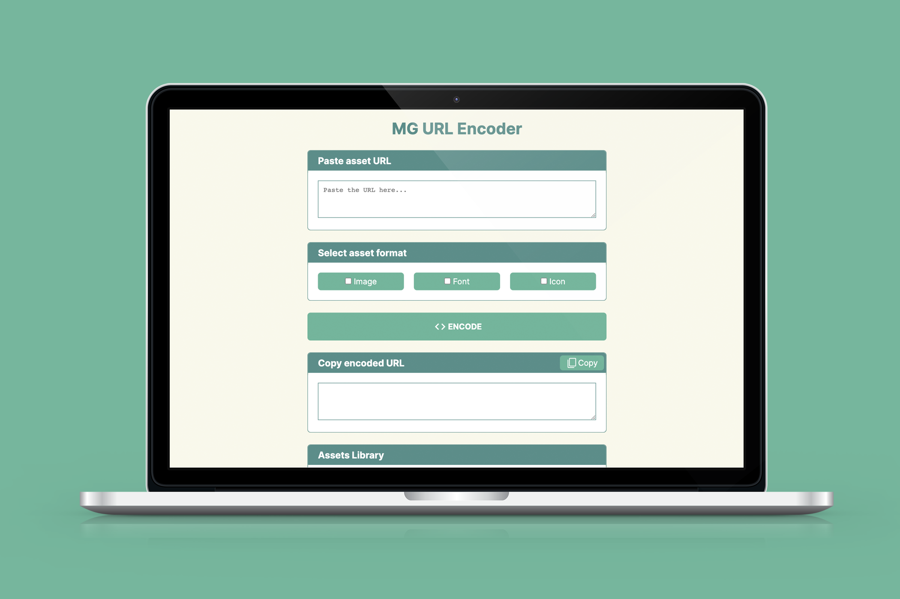

# 🔗 MG URL Encoder

A tool that encodes and customises URLs from Amazon S3 to serve CDN assets on a website - including images, font files and icons.

I designed and built this tool to speed up my workflow at work to get assets ready to be used on websites I create

## Built with:

    

## Preview:
